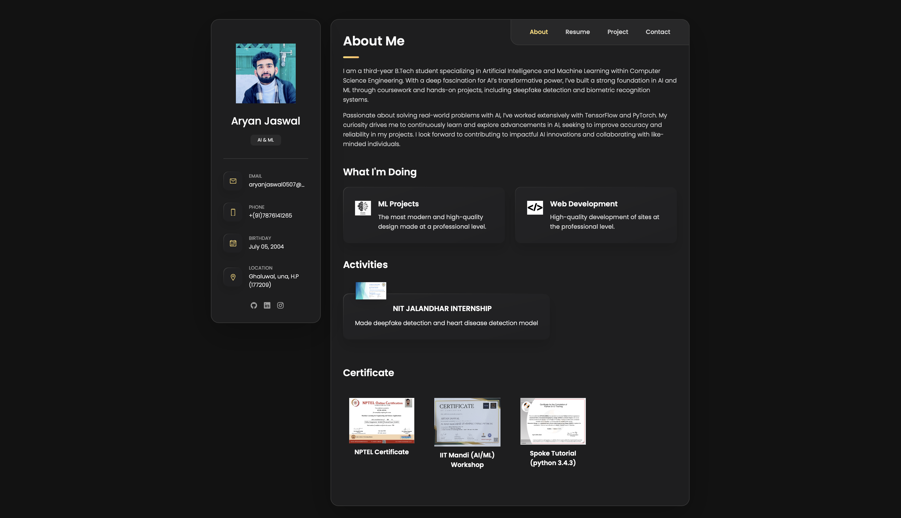
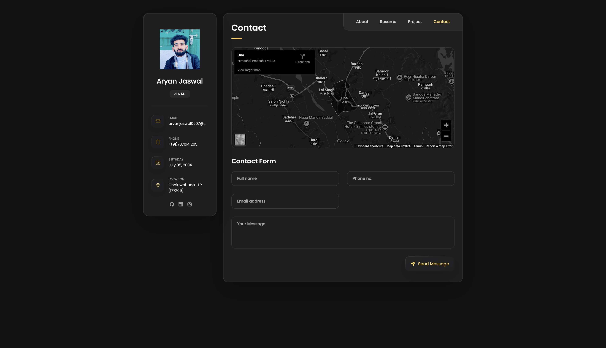

# 🌟 Personal Portfolio

🚀 Excited to share my latest project - my personal portfolio website! 🌐

## Link to Website

[Visit My Portfolio](https://aryanjaswal0507.github.io/PERSONAL-PORTFOLIO/)

## About Me

As a Computer Science student specializing in Artificial Intelligence and Machine Learning, I created this platform to showcase my skills, projects, and journey in the tech world. My portfolio website serves as a hub where visitors can learn more about me, my educational background, skills, and projects.

## Features

🔍 **About Me**: Dive into my background, education, and interests in the tech field.

📚 **Education**: Explore my academic journey, including my current pursuit of a Bachelor of Technology in CSE with a focus on AI & ML.

👨‍💻 **Skills**: Discover the programming languages, technologies, and concepts I'm proficient in, including Python, C++, HTML, CSS, and more.

💼 **Projects**: Check out some of my notable projects, such as Voice Controlled Assistant, Hand Gesture Recognition, and Recipe Website. Each project highlights my problem-solving abilities and passion for technology.

📞 **Contact**: Reach out to me directly via email or phone for collaboration opportunities, project inquiries, or just to connect!

I'm constantly updating my portfolio with new projects and experiences, so be sure to visit regularly to see what's new. Let's connect and explore how we can innovate and create together! 🚀

## Screenshots

 <!-- Adjust the path if your image is located elsewhere -->
 <!-- Adjust the path if your image is located elsewhere -->

## Technologies Used

- HTML
- CSS
- JavaScript (if applicable)
- Responsive Web Design

## How to Run the Project Locally

1. Clone the repository:
   ```bash
   git clone https://github.com/aryanjaswal0507/PERSONAL-PORTFOLIO.git
